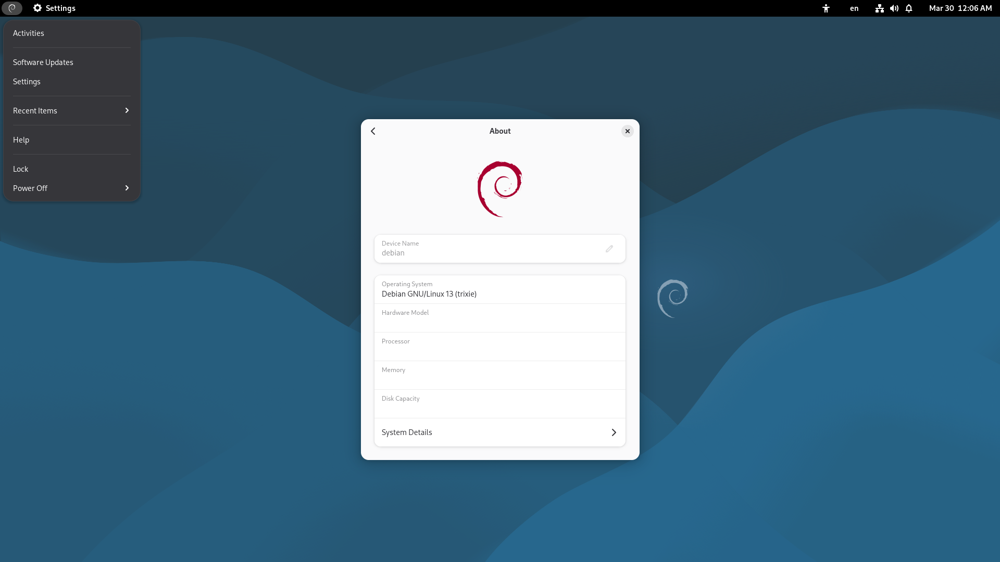

# GNOME Debian Session

A smooth GNOME session for Debian.

## Concept

- Keep GNOME as upstream as possible
- No unnecessary customization
- Stable and predictable experience

## Features

- Clean GNOME session
- Debian-friendly defaults

## Screenshot



## Installation

```bash
# copy session files
